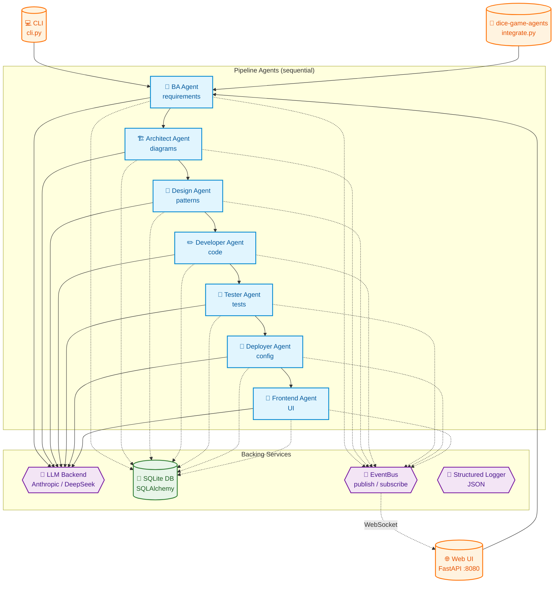
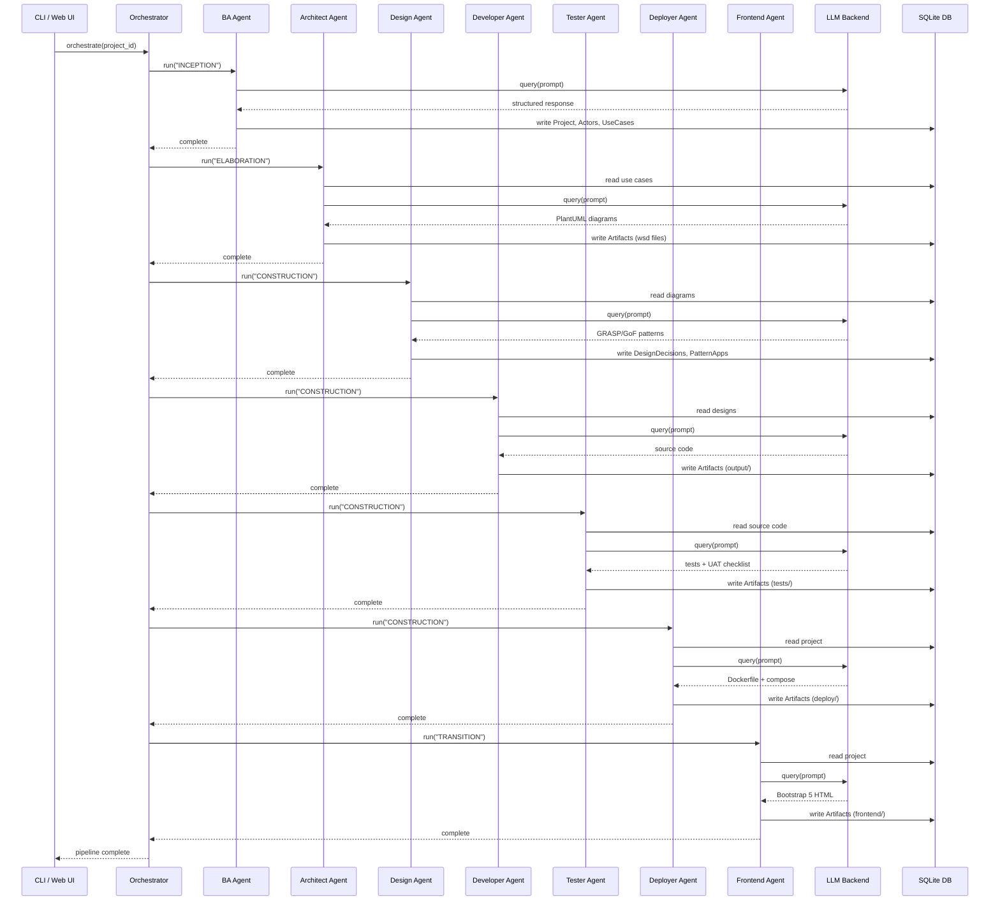
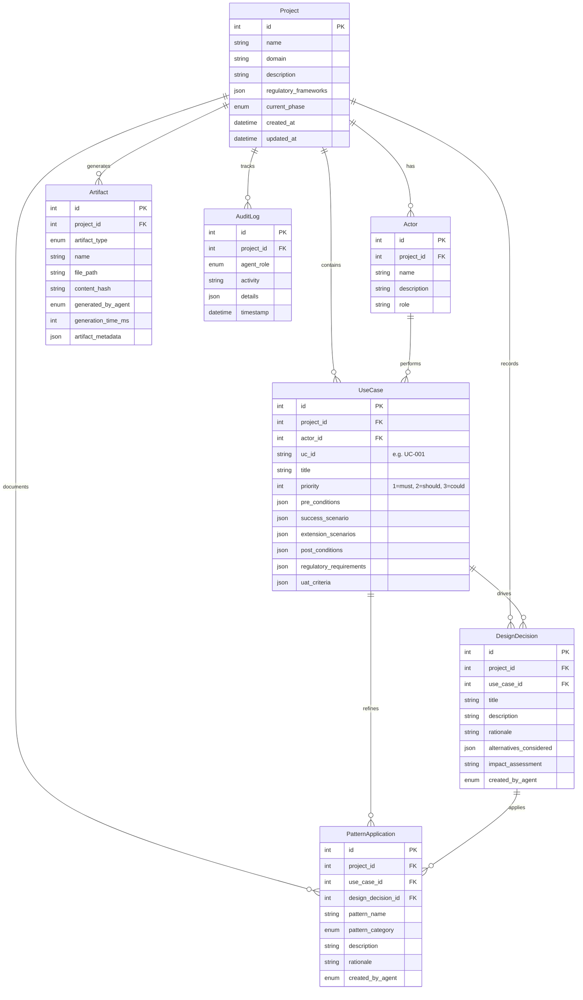
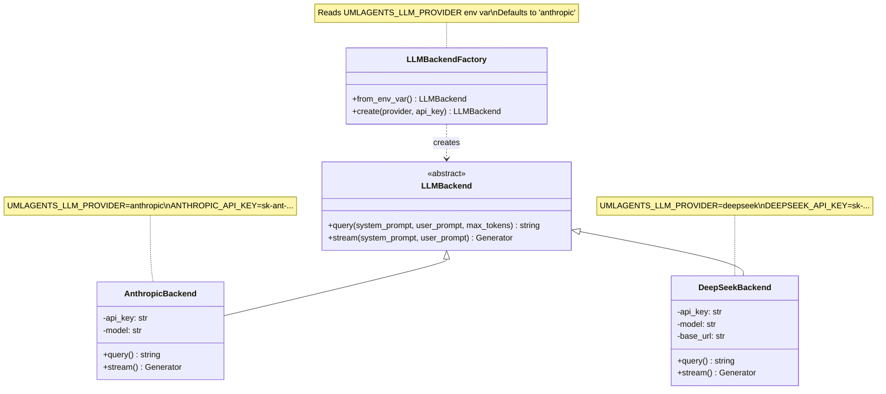
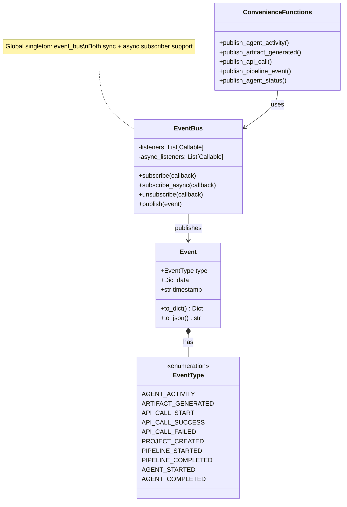
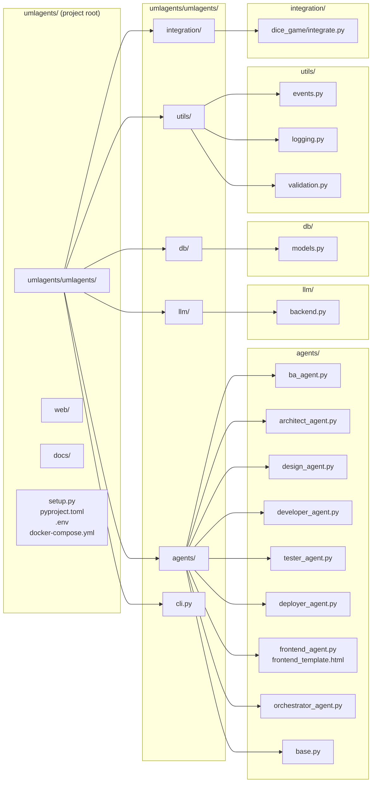
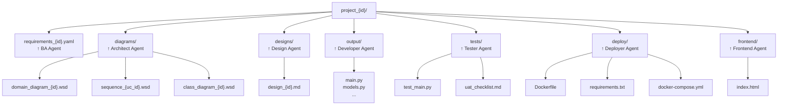

# UMLAgents — Architecture Overview

> Auto-generated by Pika ⚡ from codebase analysis

---

## 1. High-Level Pipeline Flow

---

## 2. Agent Interaction & Data Flow

---

## 3. Entity Relationship (Database Model)

---

## 4. LLM Backend Abstraction

---

## 5. Event System

---

## 6. Directory Structure

---

## 7. Generated Output Structure

---

> **Note:** These diagrams use [Mermaid](https://mermaid.js.org/) syntax. They render natively on GitHub, GitLab, Notion, and in any Markdown editor with Mermaid support. Open this file in a viewer that supports it, or paste into a GitHub README.
